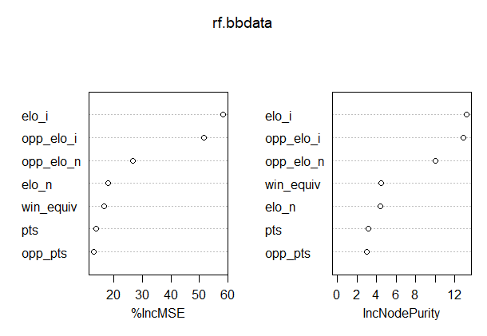
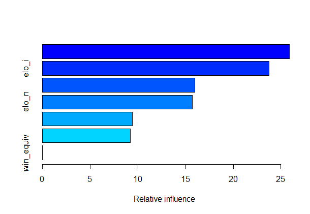
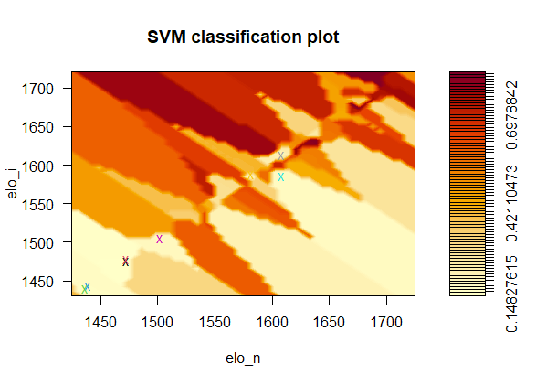

# nba-attributes
## Identifying Standout Players with a Comparative Analysis of Overall NBA/ABA Win Likelihood
### December 2020, with revisions in June 2022

### Intro
The Phoenix Suns, my hometown NBA team, have had a long-established reputation among the best (and worst) teams alike in the league. Just two seasons ago they made the NBA Finals, just two years divorced from an abysmal 19-63 season. Upturns in player acquisition (including perennial superstar Chris Paul) and team dynamics, the top seed in the Western Conference, and the best record in the league bring into question the specific attributes of their play that evolved to reach this new apogee.
However, while the 2020-21 Suns’ run was a shot in the dark, it is only one of the many thousands of potential runs that NBA teams have had since 1945. There are many more insights available in identifying potential title contenders (both in the regular season and in playoffs) even before a game starts: this is where win likelihood comes into play. Based on a wide breadth of metrics—including game point totals, win equivalency, and the head-to-head Elo rating—an estimated win likelihood can be
computed.
The dataset I use for my analysis is from the sports wing of FiveThirtyEight, specifically [nba-elo](https://github.com/fivethirtyeight/data/tree/master/nba-elo). There are 126,000+ samples with 22 labels. The formatted `nbaallelo.csv` file contains all game summary statistics from 1946 until 2015. Due to local computational limitations, I reduced the scope of this analysis to the 2006-2007 Season* with 2,600+ samples and 14∗ labels. Using the Pandas library in Python, I dropped all other season data and insignificant binary labels (unencoded team names, locations, game advantage, etc.) to reduce the number of labels down to 8 total; all other analysis was done in R.

### Analysis
To predict the per-game home team win likelihood (forecast), I use the labels `game_id`, `year_id`, `team_id`, `fran_id`, `pts`, `elo_i`, `elo_n`, `win_equiv`, `opp_id`, `opp_fran`, `opp_pts`, `opp_elo_i`, `opp_elo_n`, and `forecast`. As a note, the boosting and random forest methods used all of the aforementioned labels, while SVM was limited to `elo_i` and `opp_elo_i`. Since the season data tends to be skewed towards high-performing teams rather than who eventually make the playoffs, this is reflected in the Elo score given to the dominant team in mismatched games—and so the algorithms tend to favor Elo-family labels over others. We select encoded identifiers, points, aggregate win equivalency, and Elo-family labels for this reason. I applied boosting, random forest, and SVM methods to the 2006-2007 Season dataset for my analysis. After importing the 2006-2007 Season dataset and cleaning up extraneous labels, we first create a 50:50 train-test split. The random forest method predicts forecast against the selected labels; we choose the flags `mtry=6` for the number of variables available to split at each tree node and `importance=TRUE` to estimate the importance of each predictor. Based on the summary statistics, we know most significant predictors are `elo_i`, `opp_elo_i`, and `opp_elo_n`, with respective values of `58.23703`, `51.44667`, and `26.53503` for `IncMSE`. The `MSE` is `0.01696`.

Like random forest, boosting predicts forecast against the aforementioned selected labels; we choose the flags `n.trees=6000` for the tree iterations, `shrinkage=0.1` for an optimizing shrinkage factor, and `interaction.depth=4` for the maximum tree traversal depth. Based on this, we have a relative influence chart to measure the scaled importance of predictors on forecast: `elo_i`, `elo_n`, and `win_equiv` are the most significant. The MSE is `0.01083`.

However, when working with the SVM model, its size was far too large for my machine (for which the model size exceeded my local memory limit). To accomodate for this, I scaled down the 2006-2007 Season dataset to just the 2006-2007 Playoffs with predictors `elo_i` and `elo_n` for forecast, due to the competitive home-court advantage in the Playoffs subset of the 2006-2007 Season dataset. This was done as a precautionary measure (estimated to take 10% of the memory for the full-size 2006-2007 Season model, or 1.28 GB). The SVM uses flag `kernel=”radial”` and `cost=1`. While the SVM had 74 vectors, it appears to have over-classified due to a lack of viable predictors (home-court advantage and historic power mismatching being prevalent in the 2006-2007 Playoffs, notably with the Lakers-Suns WCF Series as contrasted with the Cavs-Pistons ECF Series).

### Conclusions
In comparing the benefits of the boosting, random forest, and SVM methods on the 2006-2007 Season dataset, the random forest method appears to have the most merits: in being able to easily-distinguish variables which have the highest-impact on predicting a specified label, we can use this in an ensembled scenario, such as with a gradient boosting algorithm. In the context of the dataset, this means more-accurate predictions using the elo i family of predictors for either team. With regards to the forecast label, both random forest and boosting methods were able to outline elo i as a viable predictor; a key difference is that random forest values both Home and Away values of the label (since this is a pre-game, incoming estimate and is thus more-likely to be similar to the outcome prediction). I would prefer boosting only in the case of an ambiguous boundary—as with a team that makes a significant, game-changing trade midseason, such as acquiring a player near the trade deadline (the Sixers dealt Allen Iverson to the Nuggets in the former half of this season, so when looking at either teams stats, we should prefer boosting). However, the SVM method has little value in the 2006-2007 Season for forecast, where there is no viable decision boundary (at least for labels for Home ELO). The main bug was in only being to work with a maximum of three predictors. We should stray away from such supervised methods in as large of a dataset as this, since [there is little to be gained with such high computational cost](http://www.gotw.ca/publications/concurrency-ddj.htm)*. The over-classification, no matter which kernel is proposed for this dataset, shows that we should prefer unsupervised methods which consider and eliminate candidate predictors.